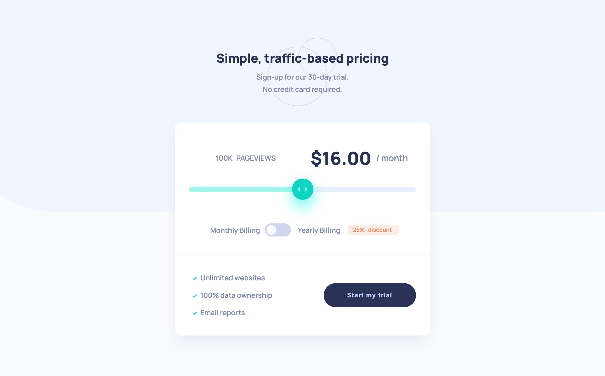

# Frontend Mentor - Interactive pricing component solution

This is a solution to the [Interactive pricing component challenge on Frontend Mentor](https://www.frontendmentor.io/challenges/interactive-pricing-component-t0m8PIyY8).

## Table of contents

- [Overview](#overview)
  - [The challenge](#the-challenge)
  - [Screenshot](#screenshot)
  - [Links](#links)
  - [Built with](#built-with)
- [Author](#author)

## Overview

### The challenge

Users should be able to:

- View the optimal layout for the app depending on their device's screen size
- See hover states for all interactive elements on the page
- Use the slider and toggle to see prices for different page view numbers

### Screenshot

Desktop layout screenshot.

### Links

- Solution URL: [Github Rep.](https://github.com/ph4ntom5/Interactive-Pricing-Component)
- Live Site URL: [Live version](https://priceless-wing-ee0ae6.netlify.app/)

### Built with

- HTML5 markup
- CSS custom properties
- TypeScript
- Flexbox
- Mobile-first workflow

## Author

- Website - [My Portfolio](https://www.toms-design.webflow.io)
- Twitter - [@tomsdesign\_](https://www.twitter.com/tomsdesign_)
